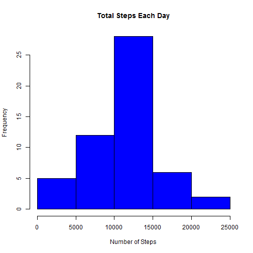
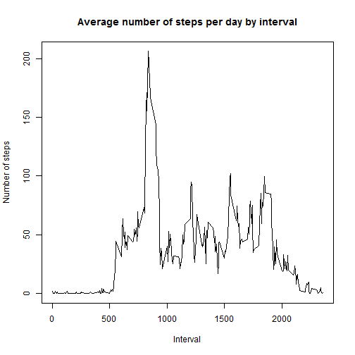
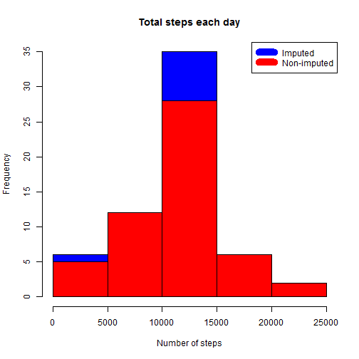
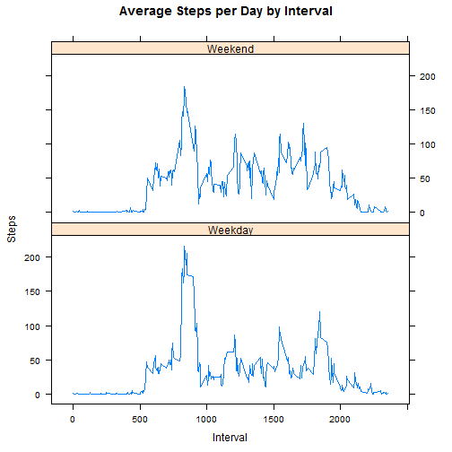

This is the first project for the Reproducible Research course in Coursera's Data Science specialization track. It will answer questions using data collected from a FitBit.

## Data
The data for this assignment was downloaded from the course web
site:

* Dataset: [Activity monitoring data](https://d396qusza40orc.cloudfront.net/repdata%2Fdata%2Factivity.zip) [52K]

The variables included in this dataset are:

* **steps**: Number of steps taking in a 5-minute interval (missing
    values are coded as `NA`)

* **date**: The date on which the measurement was taken in YYYY-MM-DD
    format

* **interval**: Identifier for the 5-minute interval in which
    measurement was taken

The dataset is stored in a comma-separated-value (CSV) file and there are a total of 17,568 observations in this dataset.

## Loading and preprocessing the data

Download, unzip and load data into data frame `data`. 

```r
if(!file.exists("repdata_data_activity.zip")) {
        download.file("https://d396qusza40orc.cloudfront.net/repdata%2Fdata%2Factivity.zip","repdata_data_activity.zip")
        unzip("repdata_data_activity.zip")
}

data <- read.csv("activity.csv")
```


## What is mean total number of steps taken per day?
Sum steps by day, make the Histogram, and calculate mean and median.

```r
steps_by_day <- aggregate(steps ~ date, data, sum)
hist(steps_by_day$steps, main = paste("Total Steps Each Day"), col="blue", xlab="Number of Steps")
```



```r
rmean <- mean(steps_by_day$steps)
rmedian <- median(steps_by_day$steps)
```

The mean is 1.0766189 &times; 10<sup>4</sup> and the median is 10765.

## What is the average daily activity pattern?

* We calculate average steps by interval for all days. 
* Plot average number steps per day by interval. 
* Match interval with most average steps. 

```r
steps_by_interval <- aggregate(steps ~ interval, data, mean)

plot(steps_by_interval$interval,steps_by_interval$steps, type="l", xlab="Interval", ylab="Number of steps",main="Average number of steps per day by interval")
```



```r
max_interval <- steps_by_interval[which.max(steps_by_interval$steps),1]
```

The 5-minute interval, on average across all the days in the data set, containing the maximum number of steps is 835.

## Impute missing values. Compare imputed to non-imputed data.

Missing values were imputed by inserting the average for each interval. 

```r
incomplete <- sum(!complete.cases(data))
imputed_data <- transform(data, steps = ifelse(is.na(data$steps), steps_by_interval$steps[match(data$interval, steps_by_interval$interval)], data$steps))
```

For the 2012-10-01 zero steps was imputed because it would have been over 9,000 steps higher than the following day (which had only 126 steps). NAs then were assumed to be zeros to fit the trend of the data. 

```r
imputed_data[as.character(imputed_data$date) == "2012-10-01", 1] <- 0
```

Recount total steps by day and create Histogram. 

```r
steps_by_day_i <- aggregate(steps ~ date, imputed_data, sum)
hist(steps_by_day_i$steps, main = paste("Total steps each day"), col="blue", xlab="Number of steps")

#Make Histogram to show difference with previous. 
hist(steps_by_day$steps, main = paste("Total steps each day"), col="red", xlab="Number of steps", add=T)
legend("topright", c("Imputed", "Non-imputed"), col=c("blue", "red"), lwd=10)
```



Compute new mean and median for imputed data. 

```r
rmean.i <- mean(steps_by_day_i$steps)
rmedian.i <- median(steps_by_day_i$steps)
```

Calculate difference between imputed and non-imputed data.

```r
mean_diff <- rmean.i - rmean
med_diff <- rmedian.i - rmedian
```

Calculate total difference.

```r
total_diff <- sum(steps_by_day_i$steps) - sum(steps_by_day$steps)
```
* The imputed data mean is 1.0589694 &times; 10<sup>4</sup>
* The imputed data median is 1.0766189 &times; 10<sup>4</sup>
* The difference between the non-imputed mean and imputed mean is -176.4948964
* The difference between the non-imputed median and imputed median is 1.1886792
* The difference between total number of steps between imputed and non-imputed data is 7.5363321 &times; 10<sup>4</sup>.


## Are there differences in activity patterns between weekdays and weekends?
Created a plot to compare number of steps between the week and weekend.  
**NOTE THAT FOR PROPER VIEWING OF THE FOLLOWING PLOT COMPARING BY WEEKDAY AND WEEKEND YOU MUST SPECIFY BELOW IN THE WEEKDAYS VARIABLE THE WEEKDAYS IN YOUR LANGUAGE. BECAUSE OF I AM IN SPAIN THE NAMES OF THE WEEKDAYS ARE IN SPANISH BUT IN YOUR COMPUTER PERHAPS THE NAMES MUST BE IN ENGLISH OR ANOTHER LANGUAGE.** 

```r
weekdays <- c("lunes", "martes", "miércoles", "jueves", "viernes")
imputed_data$dow = as.factor(ifelse(is.element(weekdays(as.Date(imputed_data$date)),weekdays), "Weekday", "Weekend"))

steps_by_interval_i <- aggregate(steps ~ interval + dow, imputed_data, mean)

library(lattice)

xyplot(steps ~ interval|dow,steps_by_interval_i, main="Average Steps per Day by Interval",xlab="Interval", ylab="Steps",layout=c(1,2), type="l")
```


